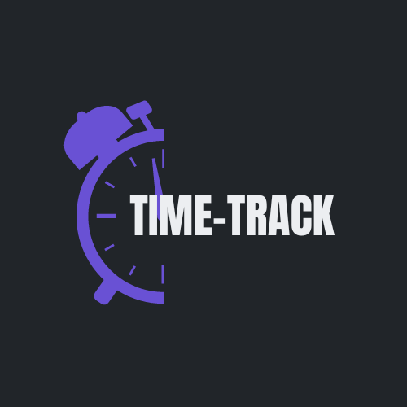

# TimeTrack
TimeTrack is a web application developed by [Your Team Name] as part of [brief description of the project's purpose, e.g., a coding bootcamp project, a software engineering course, etc.]. It allows users to preserve their cherished memories by crafting them into compelling stories.

# Table of Contents
Features
Installation
Usage
Acknowledgements
License

# Features
Memories to Stories: Transform moments into memories and memories into stories.
User Authentication: Secure login functionality for registered users.
Intuitive Interface: Easy-to-use platform for crafting and organizing stories.
Responsive Design: Optimized for various screen sizes, from desktop to mobile devices.

# Installation
To run TimeTrack locally, follow these steps:

1. Clone the repository:
bash
Copy code
git clone https://github.com/yourusername/timetrack.git
2. Navigate to the project directory:
bash
Copy code
cd timetrack
3. Install dependencies:
bash
Copy code
npm install
4. Start the development server:
bash
Copy code
npm start
5. Open your web browser and visit http://localhost:3000 to access TimeTrack.

# Usage
To use TimeTrack, follow these steps:

1. Register for an account or log in if you already have one.
2. Start creating your stories by adding memories, photos, and descriptions.
3. Organize your stories into categories or timelines.
4. Edit or delete existing stories as needed.
5. Enjoy revisiting and sharing your cherished memories with TimeTrack!

A# cknowledgements
We would like to extend our heartfelt thanks to the following individuals and organizations for their contributions, support, and inspiration:

Rutgers: Educational institution providing resources and guidance.
JD: Special thanks to JD Tadlock for his guidance and mentoring during Coding Bootcamp.

! Special thanks to all the members of our team for their dedication and hard work in bringing this project to life.

# License
This project is licensed under the MIT License.

